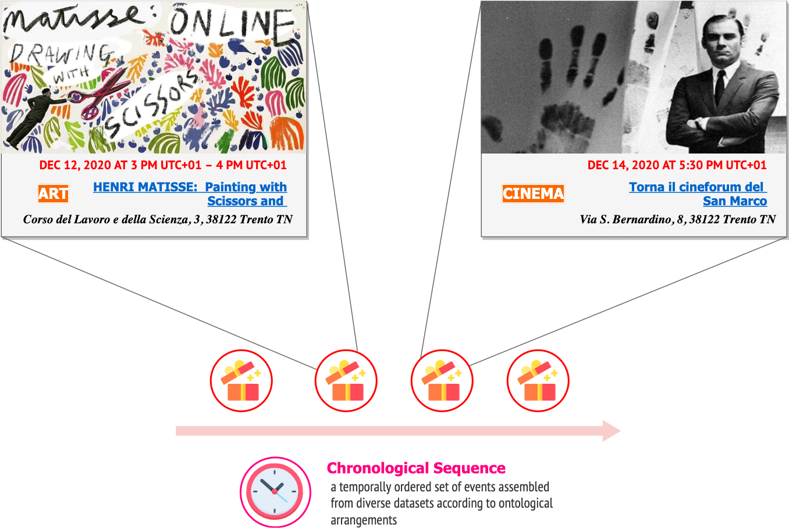

# Knowledge Representation of Touristic Events for efficient data integration

## Introduction

>__The goal of the Project:__ aims to build custom vocabulary terminologies for unambiguously representing _event_ entities prevalent in _various_ datasets at our disposal and incorporate existing entity types, object and data properties in order to minimize redefinition of the same concepts. Eventually, our ideal application is expected to respond with a set of chronological events suited to the taste of the user being concerned, and help to facilitate transportation management between geographical points as a secondary infrastructural service.

## Progress Stats

## Credits

* **Erdenebileg B.** (Data Scientist & Knowledge Engineer) - [BrainyLark](http://github.com/BrainyLark)
* **Eva Agrawal** (Data Scientist) - [EvaforData](https://github.com/EvaforData)

## Released under MIT License

Copyright (c) 2013 Mark Otto.

Copyright (c) 2017 Andrew Fong.

Permission is hereby granted, free of charge, to any person obtaining a copy of this software and associated documentation files (the "Software"), to deal in the Software without restriction, including without limitation the rights to use, copy, modify, merge, publish, distribute, sublicense, and/or sell copies of the Software, and to permit persons to whom the Software is furnished to do so, subject to the following conditions:

The above copyright notice and this permission notice shall be included in all copies or substantial portions of the Software.

THE SOFTWARE IS PROVIDED "AS IS", WITHOUT WARRANTY OF ANY KIND, EXPRESS OR IMPLIED, INCLUDING BUT NOT LIMITED TO THE WARRANTIES OF MERCHANTABILITY, FITNESS FOR A PARTICULAR PURPOSE AND NONINFRINGEMENT. IN NO EVENT SHALL THE AUTHORS OR COPYRIGHT HOLDERS BE LIABLE FOR ANY CLAIM, DAMAGES OR OTHER LIABILITY, WHETHER IN AN ACTION OF CONTRACT, TORT OR OTHERWISE, ARISING FROM, OUT OF OR IN CONNECTION WITH THE SOFTWARE OR THE USE OR OTHER DEALINGS IN THE SOFTWARE.