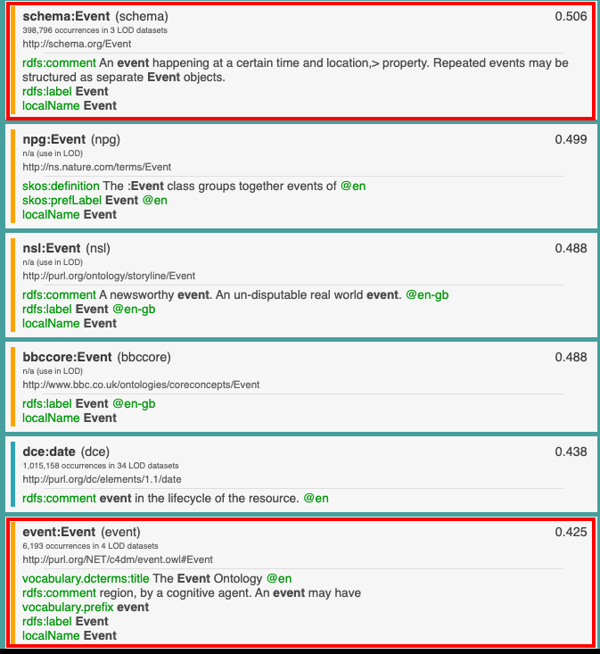
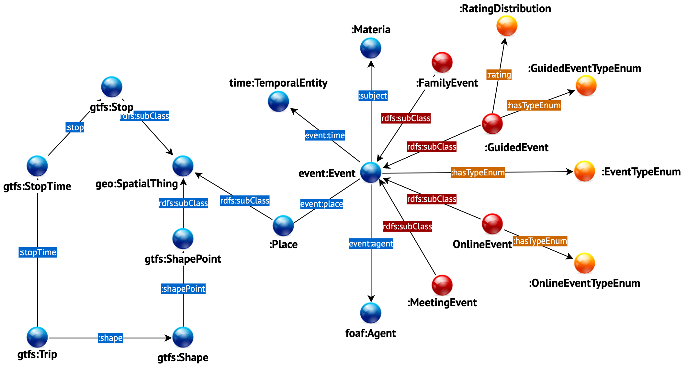
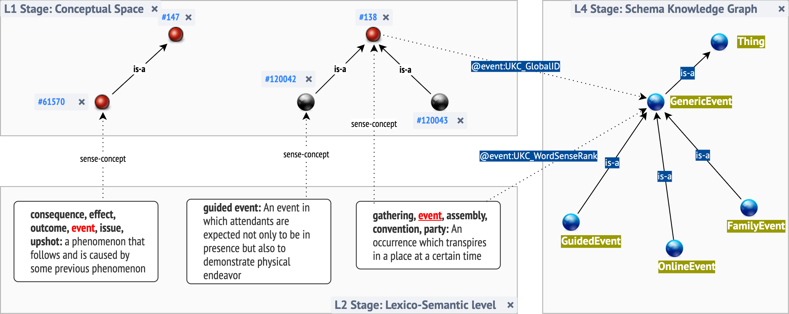

## Formal Modelling

### 1. Namespaces for the Domain

Our transition to the formalization phase is marked by our undertaking in search of already existing vocabulary terminologies that would cover the clumsy etypes defined in the informal modelling phase and the namespaces containing them. This is in an attempt to bring, as closer as we could, the gap between our rough sketch for the event domain and the commonly acknowledged standard for the same domain, so that we could get stuck by a better idea to improve the current model. 

The most frequent term *'Event'* in the EER at our disposal possesses relatively a fewer number of senses, ruling out the most of our search space in [Linked Open Vocabularies](https://lov.linkeddata.es/dataset/lov).

As demonstrated in the search result capture, there are two possible formal schemas for us to appropriate into our application. 

* At first glance, [schema.org](http://schema.org/Event) appears to fit the profile we're looking for the most parts because it is a widespread shared terminology-space and the predicates belonging there are able to cover the majority of our object (and data) properties, which means our data integration to a bigger knowledge graphs could be guarenteed and it increases the chance that concepts and senses in the UKC-KB are located way more accurately if we start from this namespace. Unfortunately, the problem arises when it comes to the sub-event categorization. It is true that we enumerated our event types instead of creating subcategories for each, just like [schema:Event](http://schema.org/Event) offers, such as detaching off *'TheaterEvent', 'MusicEvent' and 'DanceEvent'*. However, as in the argument from the previous phase, the scarcity of mining tools for extracting essential and defining properties for each subtype led to the decision to leave them under the same entity type. For example, let us say, we wish to derive *'producers', 'cast', 'stage designer'* from the description (e.g. body paragraph) property of *'TheaterEvent'* entity. Not only they are written in human natural language, but also they vary in ideosyncrasies authors display them in, making it impossible for us to write regex expressions to filter them out. In addition, although we could use APIs for named entity recognition, these cannot manage to contextualize what they have captured even if the entity in the description and its type have been recollected.
* On the other hand, [event](http://motools.sourceforge.net/event/event.html) is a lightweight ontology that incorporates [foaf](http://xmlns.com/foaf/0.1/), [time](http://www.w3.org/2006/time#) and [geo](http://www.w3.org/2003/01/geo/wgs84_pos#) to represent its key connections. Given our circumstances, assuming the unorthodox semantic representation we have of the touristic event domain, it is a better choice to embrace this ontology providing us a customization flexibility with respect to dividing the parent class into unfamiliar application-specific subevents. Though it is in no way the best schematization, considering the project period, lack of data diversity and the amount of effort necessary to fragment the properties into smaller ones as described above, we assume our assertions up to the point provided sufficient rational causalities in our decision-making.

* Here, the important change with respect to connecting the transportation and the casual event parts stream along the etype, Place, modified to become a child concept of the broader term, geo:SpatialThing. What emphasizes it from the previous phase is that SpatialThing is a container for the lat/long properties, a common signature for every type related to the geographical point. Place itself diverges as it has a proper address where event to be organized, whereas ShapePoint has the sequence to identify which point it is for a certain Shape. Eventually, this custom arrangement allows us to find the most appropriate trip to the event place, by locating the nearest shape (almost a directed route), then tagging along with it to find the available time and stations to reach.
* Finally, another substantial part of our application, the data representation regarding transit feed system, is covered by [gtfs](http://vocab.gtfs.org/gtfs.ttl#) ontology. Given the datasets, we are sure to decorate them with the classes provided by the namespace. Nonetheless, it doesn't put forward the object properties connecting the domains and ranges, apparently due to changeability in their designs.

### 2. Annotation with the UKC

In spite of the original instruction for us to decorate the etypes using annotation properties UKC\_GlobalID and UKC\_WordSenseRank, we decided to follow the etype-GID_ID format referred in the demo presentation, in an attempt to avoid potential naming violation that we could encounter in the later stages.

With respect to the concept availability, there appeared to exist the entity types concerning public transportation sub-system, perhaps adjusted by the other teams, offering resources for us to cut our updating senses in half. Subsequently, we prepared the following five major concepts as well as their hierarchical relationship metadata:

1. **OnlineEvent [GID-120042]** *`IS-A Event [GID-138]`*: A special type of event with the participants prompted to engage in remotely (**Word form:** Remote Event)
2. **FamilyEvent [GID-120044]** *`IS-A Event [GID-138]`*: 	A type of event organized by a local volunteers to enrich communication exchange between families (**Word form:** Family Appointment)
3. **GuidedEvent [GID-120043]** *`IS-A Event [GID-138]`*: 	A particular arrangement in which attendants are expected not only to be in presence but also to demonstrate physical endeavor (**Word form:** Guided Outdoor Activity)
4. **OnlineEventType [GID-120045]** *`IS-A Enumeration [GID-34789]`*: Enumerated types for the online events, including such as painting, sightseeing and visiting museums (**Word form:** Remote Event Category)
5. **GuidedEventType [GID-120046]** *`IS-A Enumeration [GID-34789]`*: Categories of physical activities, especially mountain hiking, skiing and climbing (**Word form:** Guided Outdoor Activity Typology)