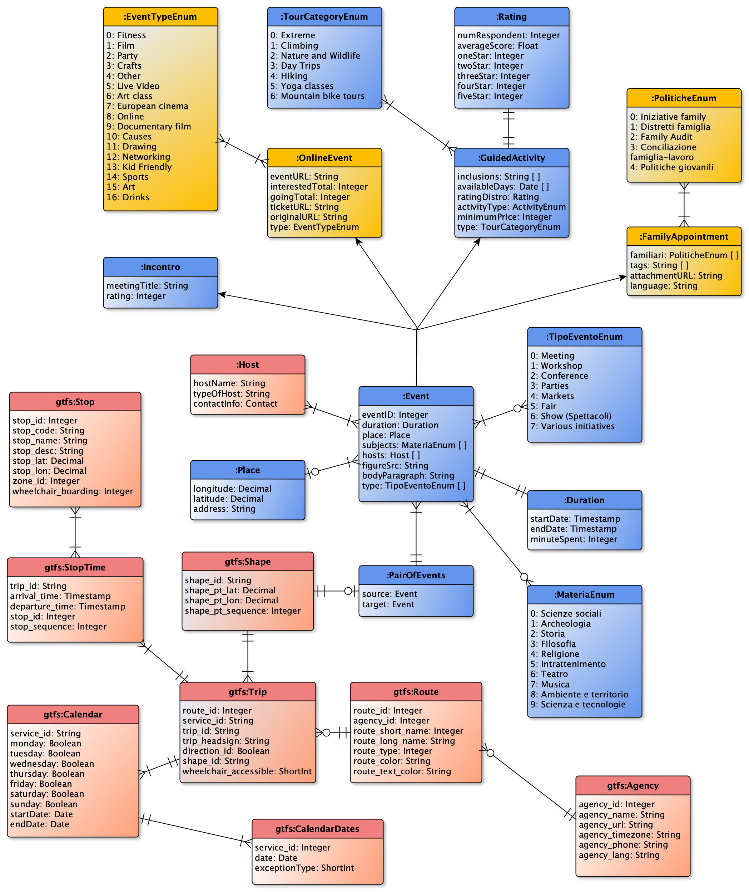

## Informal Modelling

>According to the compatibility of the requirements from the queries defined earlier with the entity types which can be formed out of the available datasets, a rough blueprint for the application frame is constructed as follows. 

As illustrated in the entity relationship diagram, the main application is supposed both to (1) deliver requested **events** belonging to various typologies and (2) to promote **transportation means and routes** for carrying the customer between a pair of events. Nevertheless, the latter is not strictly followed as there would be many instances where the origination or the destination cannot be the geographical information with respect to an event, but randomly given points (e.g the current location). In addition, the uniqueness for this modelling prompts us to deal with a great deal of temporal and spatial relationships between the transit system and events being transpired regardless of any other intervention, emphasizing the significant essences that must be optimized throughout the rest of the phases.

### Etypes and Properties

#### 1. Criteria in creation of subclasses

Decomposing an entity type further into subcategories in presence of semantic heterogeneity (in our case, it's *"Event"*) from different sources can lead to two potential issues. 

* First, failure to provide the set of defining properties for a subcategory might obscure the significance of branching out a new category. Exemplifying from our project, *"Market"* etype missing the properties of items to be sold there and the others highlighting its distinction from surrounding etypes puts itself in a position where *"Market"* is a regular *"Event"*. 
* Secondly,  the datasets springing from completely incongruent platforms establish inherently divergent entity types, while having conceptually synonymous notions. For instance, the facebook-dependent properties such as *'interested'* and *'going'* contextualize its own entities virtually nowhere around the rating systems which could be offered from different websites. 

By taking into account these two points, our solution attempted to distinguish conceptual hierarchies as much apart as possible with respect to their difference in properties and conceptually abstract definitions.

#### 2. Composition and Arrangement

In this subsection, there is a comprehensive explanation concerning the entity classification into *common*, *core* and *contextual* data models. In order to designate etypes in their correct environment, we might want to keep in mind two things: rigorous statements corresponding to each category and the ultimate goal of our application. The assertions clearly reflect on our understanding of the entity divisive system, meaning they merely are assumptions being hold true for the remaining parts.

1. **Core etypes:** fundamental building blocks (denoted in blue background) without which the main application cannot function in accordance with its primary requirements. *Event* is the most generic yet the most instrumental entity in the program, defined as taking place in a certain _location_ in a given _duration_. Although there are several different types of sub-events to emerge, it is efficient to have them as enumerated types (*TipoEventoEnum* and *MateriaEnum*), assuming the rarity of data records belonging to each type and the lack of diversity having them distinguished. From there, _GuidedActivity_, which compels participants to display physical endeavors and initiatives, branch out to create a subclass. Due to the source web from which it has been extracted, it also incorporates an extensive list of local properties.